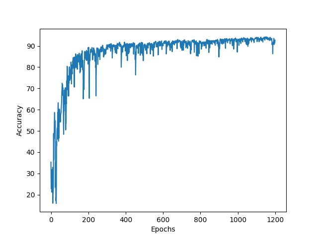
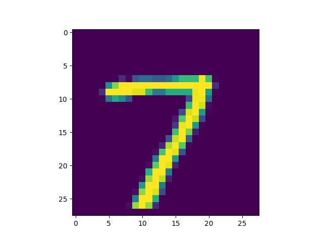

# About

Simple feed forward neural network written from scratch that use only numpy and does digit recognition (use MNIST handwritten dataset)

# Running

## Install dependencies and tun test script
```
python3 -m pip install -r requirements.txt
python3 test.py
```

## Example output

```
100%|█████████████████████████████| 1200/1200 [15:15<00:00,  1.31it/s, acc=92.8]
Train Accuracy: 92.75
Test Accuracy: 92.63
Predicted:  7
```

### Performance Graph


### Test Example
